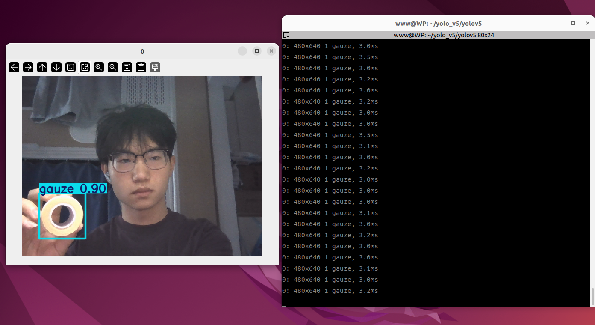

# 考核标准
- 根据教程完成下面的yolov5训练流程
- 需要使用**自己的数据集**进行训练，可以手机拍摄100张左右的目标物体图片，需要转成JPEG格式
- 将自己在学习过程中遇到的**问题**和**解决方法**记录在笔记中，可手写也可电子文档或者markdown格式
- 提交文件包括：
  1. 学习笔记（手写则拍照上传，电子文档则直接上传）
  2. 如下图所示提交一张**训练结果**截图,检测图像中需要**本人出镜**
- 将提交文件压缩成zip文件，命名为“班级+姓名.zip”，发送给群管理员
- 提交截止时间暂定为：2026年9月21日（后续可能根据整体完成情况调整）
- 如果没有完全完成整个教程，则根据笔记及具体完成进度评定

# 点击此链接查看教程

[yolov5训练流程](docs/yolov5训练流程.ipynb)

# 科学上网教程请查看：

[科学上网教程](docs/科学上网教程.md)