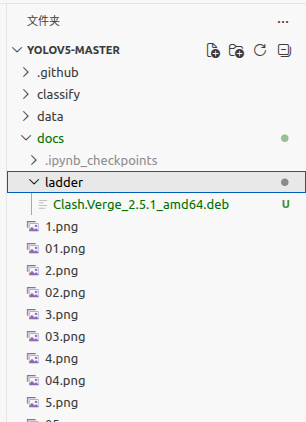
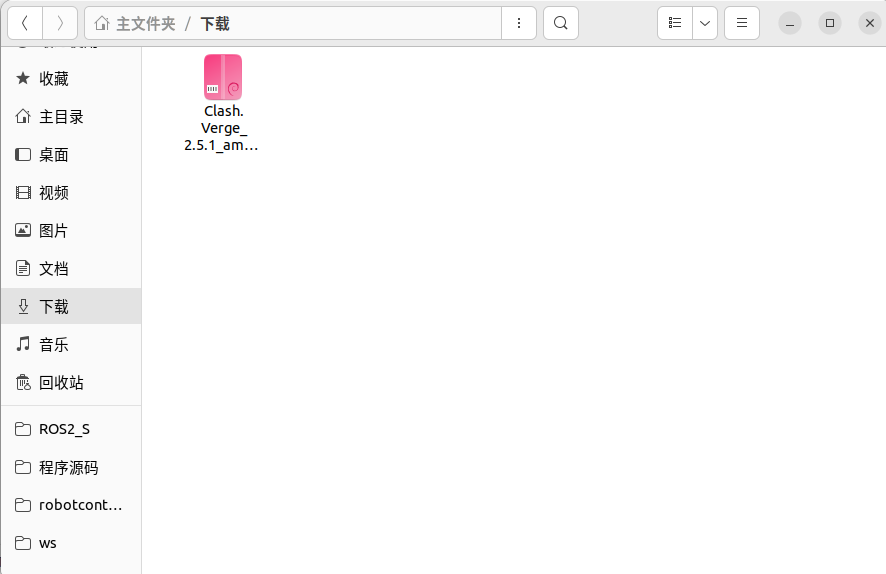
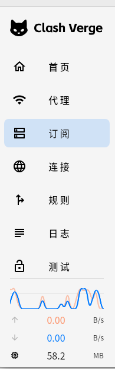
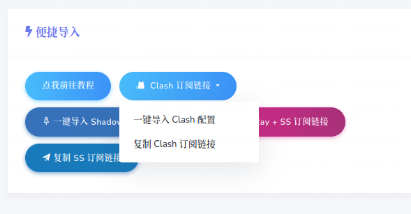
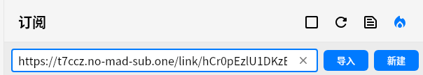
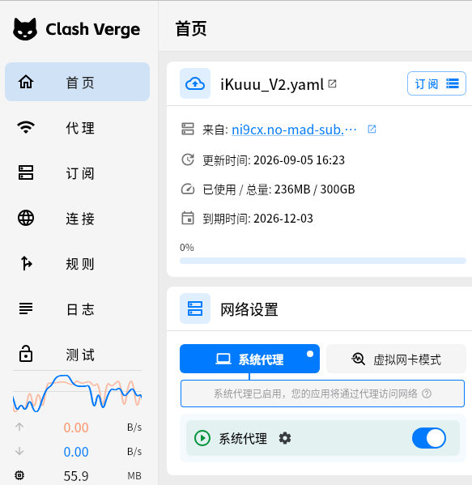

# 仅限此次实验室招新使用禁止转载外传

## 安装clash verge
- 官方github下载地址：
https://github.com/clash-verge-rev/clash-verge-rev/releases/tag/v2.5.1

本仓库也提供了clash verge的安装包，下载后直接安装即可
1. 将ladder/Clash.Verge_2.5.1_amd64.deb文件复制到`~/下载`目录下，执行命令安装：


- 下载目录：



- 打开终端（ctrl+alt+t打开终端）输入以下命令安装：
```bash
cd ~/下载
#如果出现报错没有安装完成复制报错命令给deepseek让其帮你查问题
sudo dpkg -i Clash.Verge_2.5.1_amd64.deb
#或者使用下面命令修复依赖再使用上一个命令安装
sudo apt --fix-broken install
``` 
- 安装完成后点击屏幕左下角的九个点图标，搜索Clash Verge，点击打开
- 如果没有出现图标，说明安装失败，请将终端报错信息截图发送给deepseek帮你解决问题

## 配置clash verge
1. 打开Clash Verge后点击左侧配置


- 进入此网站购买订阅

https://ikuuu.foo/user
购买后点击网站首页右侧`clash订阅链接`点击复制链接



2. 返回clash verge并点击订阅文件链接将购买的订阅链接复制进去并点击导入



3. 返回首页将网络设置内的`系统代理`打开，检查右侧节点是否超时
- 如果超时则进入左侧代理内选择全局并选择一个能连上的节点


- 完成后即可正常使用科学上网